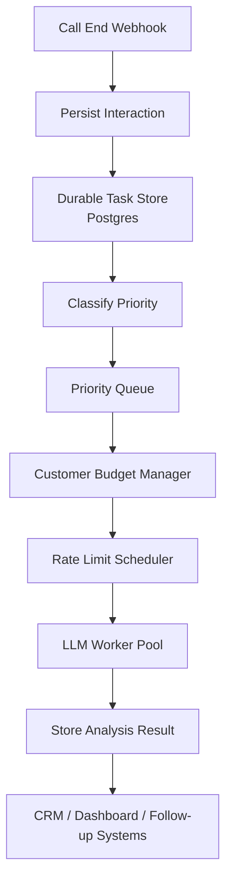

# Post-Call Processing Pipeline — Design Document

**Author:** Praveen P Saunshi
**Date:** 01/07/2026


## 1. Assumptions

_State every assumption you made about the business, system, or environment. Be specific. These will be discussed in the follow-up._

**Before designing the solution, I made a few assumptions**
1. The platform processes a very large number of calls (around 100K per campaign).
2. Different customers have different priorities and SLAs.
3. Some call outcomes are more important than others (for example, a successful sale or an escalation).
4. Call recordings may become available few minutes after the call ends.
5. LLM providers enforce hard rate limits (requests per minute and tokens per minute).
6. Transcripts and recordings contain sensitive customer data.
7. The business cannot accept silent failures or lost interactions.

## 2. Problem Diagnosis
_Before designing anything: what is actually broken, and why does it break at scale? In your own words._

**The main issue is not the LLM itself — it is how requests are sent to the LLM**
Right now, every completed call immediately triggers analysis. During a large campaign, thousands of calls can finish within a short time window. The system then sends LLM requests much faster than the provider allows.

**That creates a chain reaction:**
1. LLM returns 429 rate limit errors.
2. Celery retries pile up.
3. Redis queues grow uncontrollably.
4. Workers become overloaded.
5. Some tasks are eventually lost or delayed.
6. There are also two reliability problems:
    * The fixed 45-second wait for recordings can miss late recordings.
    * In-flight tasks can disappear if Redis or a worker restarts.

## 3. Architecture Overview



### Key design decisions

1. Introduce queue-based processing.
2. Implement customer-level token budgets.
3. Use priority-based scheduling.
4. Add durable storage.
5. Implement retry mechanisms.
6. Provide end-to-end observability.

## 4. Rate Limit Management

_This is the primary problem. How does your system respect LLM rate limits across 100K calls?_
**The system uses a Token Bucket algorithm.**

### How you track rate limit usage
**Global Limits**
  * 500 requests per minute.
  * 90,000 tokens per minute.

### How you decide what to process now vs. defer
**Each request must obtain**
  * Request token.
  * Token allocation.

**If capacity exists**
  * Process immediately.

**If capacity is exhausted**
  * Move to deferred queue

### What happens when the limit is hit (recovery, not crash)
The system never crashes due to rate limits.

**Instead**:Requests wait until capacity becomes available.

---

## 5. Per-Customer Token Budgeting

_If total capacity is N tokens/min and K customers are active simultaneously:_

**How do you allocate capacity across customers?**
  * Total available capacity is divided among active customers.

**What guarantees does a customer with a pre-allocated budget receive?**
      * Customer	   Token Budget
      * Customer A	    30%
      * Customer B	    20%
      * Customer C	    50%

**What happens when a customer exceeds their budget?**
  * Requests move to deferred processing.
  
**What happens to unallocated headroom?**
  * Returned to a shared pool.
---

## 6. Differentiated Processing

_Some call outcomes are time-sensitive. Some can wait. How do you determine which is which?_

Calls are classified using business rules.
* High Priority
* Medium Priority
* Low Priority

_What mechanism do you use — is it a classification step, a flag set by the business, something else? Justify your choice._
Calls are classified using business rules.
* High Priority
* Medium Priority
* Low Priority
High-priority calls get processed first. Low-priority calls can wait when the system is under heavy load.

---

## 7. Recording Pipeline

_Replacement for `asyncio.sleep(45s)`. How does it work? What does a failure look like to the on-call engineer?_

**The current sleep(45s) is risky because recordings may arrive later.**

Instead, I would use exponential backoff:

* Retry after 30s
* Retry after 60s
* Retry after 120s
* Retry after 300s
Maximum retry window: 30 minutes.
If the recording still does not exist, the task is marked FAILED and a structured alert is generated.

---

## 8. Reliability & Durability

_How do you ensure no analysis result is permanently lost?_
I would move task state into Postgres instead of relying only on Redis.

Each task has a status:
* PENDING
* RUNNING
* COMPLETED
* FAILED
If a worker crashes, RUNNING tasks are automatically returned to PENDING and retried.
This ensures no interaction is permanently lost.

---

## 9. Auditability & Observability

_How would you debug a specific failed interaction 3 days after the fact?_
* interaction_id: INT-123
* customer_id: CUST-45
* event: llm_completed
* status: success

### What you log (and what fields every log event includes)
Every log event should include:
* interaction_id
* customer_id
* campaign_id
* event_type
* status
* timestamp

### Alert conditions
* An engineer should be able to trace a call from webhook → recording → LLM → CRM push using the same interaction_id.
---

## 10. Data Model

_Schema changes required. Show the SQL._

```sql
-- CREATE TABLE interaction_tasks (
    interaction_id VARCHAR(100) PRIMARY KEY,
    customer_id VARCHAR(100),
    priority VARCHAR(20),
    status VARCHAR(20),
    retry_count INT DEFAULT 0,
    created_at TIMESTAMP,
    updated_at TIMESTAMP
);

CREATE TABLE customer_token_budget (
    customer_id VARCHAR(100) PRIMARY KEY,
    allocated_tokens INT,
    consumed_tokens INT,
    last_reset TIMESTAMP
);

CREATE TABLE audit_logs (
    id BIGSERIAL PRIMARY KEY,
    interaction_id VARCHAR(100),
    event_type VARCHAR(100),
    status VARCHAR(50),
    message TEXT,
    created_at TIMESTAMP
);
```

---

## 11. Security

_What data in this system is sensitive? How do you protect it at rest and in transit?_
To secure the system:
* Encrypt recordings and transcripts before storing them.
* Use HTTPS for all communication between services.
* Restrict access using role-based access control (RBAC).
* Never log personally identifiable information (PII) unless absolutely necessary.
* Encrypt database backups.
* Store API keys and secrets securely using a secret manager instead of hardcoding them.
* Enable audit logging for administrative actions.
These measures help protect customer data both while it is stored and while it is being transmitted.

---

## 12. API Interface

_Did you change the API contract (`POST /session/.../end`)? If yes, explain why. If no, explain why you kept it._
I would not change the existing API contract.
* POST /session/{session_id}/end

Keeping the API unchanged has several advantages:
* Existing clients continue to work without modification.
* No API versioning is required.
* The improvements remain internal to the processing pipeline.
* Deployment becomes less risky because client integrations are unaffected.

---

## 13. Trade-offs & Alternatives Considered

| Option | Why Considered | Why Rejected / What You Chose Instead |
|Process every interaction immediately|Lowest possible latency|This easily exceeds the LLM provider's rate limits. I chose queue-based scheduling instead|
|Fixed 45-second delay before fetching recordings|Simple implementation|Recordings are sometimes available later than expected, resulting in missed recordings. I replaced it with retries using exponential backoff|

---

## 14. Known Weaknesses

_What are the gaps in your design? What would you address next?_
Although this design improves reliability and scalability, there are still some limitations.
* The priority classification is currently based on predefined business rules. As customer requirements evolve, these rules may need regular updates.

---

## 15. What I Would Do With More Time

_Specific, prioritised list — not a generic wishlist._

1. Add automatic scaling of worker instances based on queue depth and LLM utilization.
2. Introduce AI-based priority classification using historical interaction data instead of rule-based categorization
